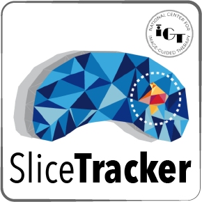
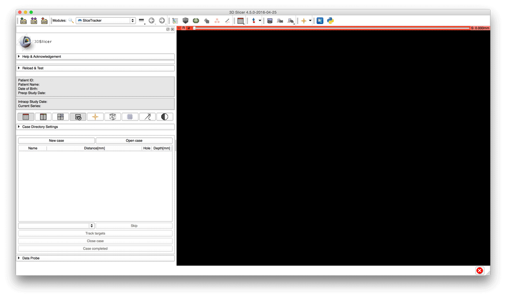

### Overview

SliceTracker is a [3D Slicer](http://slicer.org) extension designed to support the workflow of the in-bore MRI-guided targeted prostate biopsy (MRgBx) (see references below for [clinical context](http://ncigt.org/prostate-biopsy)). SliceTracker was developed and tested to support transperineal MRgBx procedure in the [Advanced Multimodality Image Guided Operating (AMIGO)](http://www.brighamandwomens.org/research/amigo/default.aspx) at the Brigham and Women's Hospital, Boston. Its applicability to other types of procedures has not been evaluated.

Capabilities of SliceTracker include:
* automatic processing of the patient DICOM images
* planning of the procedure (biopsy target localization)
* calibration of the intra-procedural image frame of reference with the transperineal biopsy template
* automated segmentation of the prostate gland
* deformable intensity-based registration to support
 * re-identification of the pre-procedurally defined targets in the intra-procedural images
 * automated, continuous tracking of the biopsy targets during the course of the procedure
* structured collection of the relevant data during the course of the procedure (images, results of segmentation and registration, target tracking)
* visualization of the intra-procedural images and support of specialized hanging protocols to facilitate needle tracking, biopsy template and calibration device visualization, assessment of the image registration results, etc.

For more details, please read [SliceTracker user guide](https://slicerprostate.gitbooks.io/slicetracker).

### Disclaimer

SlicerTracker, same as 3D Slicer, is a research software. **SliceTracker is NOT an FDA-approved medical device**. It is not intended for clinical use. The user assumes full responsibility to comply with the appropriate regulations.  

### Support

Please feel free to contact us for questions, feedback, suggestions, bugs, or you can create issues in the issue tracker: https://github.com/SlicerProstate/SliceTracker/issues

* [Andrey Fedorov](https://github.com/fedorov) fedorov@bwh.harvard.edu

* Christian Herz cherz@bwh.harvard.edu

* Peter Behringer peterbehringer@gmx.de

### Acknowledgments

Development of SliceTracker is supported in part by the following NIH grants: 

* P41 EB015898 National Center for Image Guided Therapy (NCIGT), http://ncigt.org
* U24 CA180918 Quantitative Image Informatics for Cancer Research (QIICR), http://qiicr.org
* R01 CA111288 Enabling Technologies for MRI-guided prostate interventions

Several components of SliceTracker were adopted from other open source projects
as follows:
* Needle guidance core functionality was adopted from
  https://github.com/ProstateBRP/NeedleGuideTemplate, courtesy Junichi
  Tokuda @tokjun
* [Z-frame
  calibration](https://github.com/SlicerProstate/SliceTracker/commits/master/ZFrameCalibration)
  was adopted from the [ProstateNav module of 3D Slicer version
  3](https://www.slicer.org/slicerWiki/index.php/Modules:ProstateNav-Documentation-3.6) (see source
  code [here](https://github.com/SlicerProstate/ProstateNav), no revision
  history); although we
  do not have the precise record of contribution to that functionality in the
  ProstateNav module, we believe main contributors were Junichi Tokuda and
  Simon Di Maio (while at BWH, now at [Intuitive
  Surgical](http://www.intuitivesurgical.com/))

### References

The following publications cover different aspects of work that led to the development of SliceTracker.

1. Behringer P., Herz C., Penzkofer T., Tuncali K., Tempany C., Fedorov A. 2015. Open-­source Platform for Prostate Motion Tracking during in­-bore Targeted MRI­-guided Biopsy. In: MICCAI Workshop on Clinical Image-based Procedures: Translational Research in Medical Imaging. DOI: [10.1007/978-3-319-31808-0_15](http://doi.org/10.1007/978-3-319-31808-0_15) (also see the [accompanying web site](http://slicerprostate.github.io/ProstateMotionStudy/)): **software development, prostate motion tracking**.
2. Fedorov A., Beichel R., Kalpathy-Cramer J., Finet J., Fillion-Robin J-CC., Pujol S., Bauer C., Jennings D., Fennessy F., Sonka M., Buatti J., Aylward S., Miller J V., Pieper S., Kikinis R. 2012. 3D Slicer as an image computing platform for the Quantitative Imaging Network. Magnetic resonance imaging 30:1323–1341. DOI: [10.1016/j.mri.2012.05.001](http://doi.org/10.1016/j.mri.2012.05.001): **3D Slicer platform**.
3. Fedorov A., Tuncali K., Fennessy FM., Tokuda J., Hata N., Wells WM., Kikinis R., Tempany CM. 2012. Image registration for targeted MRI-guided transperineal prostate biopsy. Journal of magnetic resonance imaging: JMRI 36:987–992. DOI: [10.1002/jmri.23688](http://doi.org/10.1002/jmri.23688): **deformable registration approach**.
4. Penzkofer T., Tuncali K., Fedorov A., Song S-E., Tokuda J., Fennessy FM., Vangel MG., Kibel AS., Mulkern RV., Wells WM., Hata N., Tempany CMC. 2015. Transperineal in-bore 3-T MR imaging-guided prostate biopsy: a prospective clinical observational study. Radiology 274:170–180. DOI: [10.1148/radiol.14140221](http://doi.org/10.1148/radiol.14140221): **clinical results**.
5. Tokuda J., Tuncali K., Iordachita I., Song S-EE., Fedorov A., Oguro S., Lasso A., Fennessy FM., Tempany CM., Hata N. 2012. In-bore setup and software for 3T MRI-guided transperineal prostate biopsy. Physics in medicine and biology 57:5823–5840. DOI: [10.1088/0031-9155/57/18/5823](http://doi.org/10.1088/0031-9155/57/18/5823): **procedure technical setup**.

